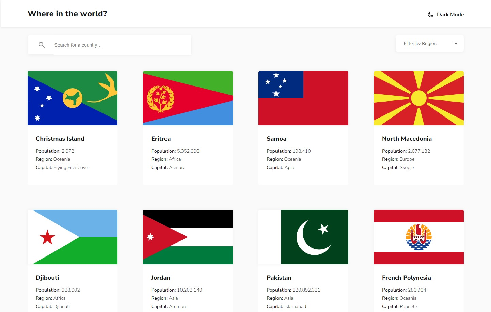

# Frontend Mentor - REST Countries API with color theme switcher solution

This is a solution to the [REST Countries API with color theme switcher challenge on Frontend Mentor](https://www.frontendmentor.io/challenges/rest-countries-api-with-color-theme-switcher-5cacc469fec04111f7b848ca). Frontend Mentor challenges help you improve your coding skills by building realistic projects. 

## Table of contents

- [Overview](#overview)
  - [The challenge](#the-challenge)
  - [Screenshot](#screenshot)
  - [Links](#links)
- [My process](#my-process)
  - [Built with](#built-with)
  - [What I learned](#what-i-learned)
- [Author](#author)

## Overview

### The challenge

Users should be able to:

- See all countries from the API on the homepage
- Search for a country using an `input` field
- Filter countries by region
- Click on a country to see more detailed information on a separate page
- Click through to the border countries on the detail page
- Toggle the color scheme between light and dark mode 

### Screenshot

### Links

- Solution URL: https://github.com/Wojtek-A/rest-countries-api-frontend-mentor/
- Live Site URL: https://wojtek-a.github.io/rest-countries-api-frontend-mentor/

## My process

### Built with

- Semantic HTML5 markup
- CSS custom properties
- SCSS SASS
- JavaScript
- jQuery - JS library
- Mobile-first workflow

### What I learned

A bit of jQuery.

## Author
- Frontend Mentor - https://www.frontendmentor.io/profile/Wojtek-A/
- GitHub - https://github.com/Wojtek-A/
